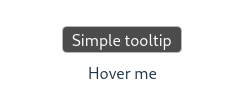

# 💬 Toolpop

[](https://www.npmjs.com/package/toolpop)
[](https://www.npmjs.com/package/toolpop)

[](https://github.com/jsonkody/toolpop)

A **very lightweight** Vue 3 `v-pop` directive for tooltips and headless image/tooltips.

- ✅ **Only one dependency:** [Floating UI](https://floating-ui.com)
- ✅ Automatically **stays visible** – flips to the other side if needed
- ✅ Minimal setup – just `v-pop`, optionally with `:top`, `:right`, etc.
- ✅ Reactive

```ts
<p v-pop="'Simple tooltip'">Hover me</p>
```



## 📦 Installation

With **pnpm**:

```sh
pnpm add toolpop
```

With **npm**:

```sh
npm i toolpop
```

🚀 Usage

## Manual registration

```ts
import { pop } from "toolpop";
app.directive("pop", pop); // You can rename it
```

Use it in your templates:

```html
<p v-pop="'Simple tooltip'">Hover me</p>
```

Or with a custom name:

```ts
app.directive("gandalf", pop);
```

```html
<p v-gandalf="'A wizard is never late...'">Text</p>
```

## As a plugin (auto-registration)

```ts
import PopDirective from "toolpop";
app.use(PopDirective); // Registers globally as v-pop
```

# 🛠 Modifiers

- `html` – treat value as raw HTML (innerHTML), for images or rich content
- `top | right | bottom | left` – tooltip position (default: top)

## 💡 Examples

[Live Demo at StackBlitz](https://stackblitz.com/edit/toolpop?file=src%2FApp.vue)

```ts
<script setup lang="ts">
import { ref } from 'vue';

const count = ref(0);
const img_1 = ``;
const img_2 = ``;

// lightweight i18n - in real project you should use Pinia store
const lang = ref<'en' | 'cs'>('en');

const $t = (en: string, cs: string) => {
  return lang.value === 'en' ? en : cs;
};

const toggleLang = () => {
  lang.value = lang.value === 'cs' ? 'en' : 'cs';
};
</script>

<template>
  <!-- updating value of `count` in tooltip -->
  <button v-pop="`count is ${count}`" @click="count += 1">
    counter ({{ count }})
  </button>

  <!-- just simple tooltip -->
  <p v-pop="'Simple tooltip'">Hover me</p>

  <p v-pop.html="img_1">html -> bekinka</p>

  <p v-pop:bottom.html="img_2">html -> boo</p>

  <h2
    v-pop="
      $t('Does it update on language change?', 'Mění se to při změně jazyka?')
    "
  >
    {{ $t('Testing languages', 'Testuji jazyky') }}
  </h2>

  <p v-pop:right="`lang: ${lang}`">lang: {{ lang }}</p>

  <button
    @click="toggleLang"
    v-pop:bottom="$t('Click to toggle language', 'Kliknutím změň jazyk')"
  >
    {{ $t('Toggle lang', 'Změň jazyk') }}: {{ lang }} -&gt;
    {{ lang === 'cs' ? 'en' : 'cs' }}
  </button>
</template>
```

## 📁 Alternative usage

You can also copy the raw content of `/src/pop.ts` and register it locally as a regular Vue directive.

## 🌐 Projects using this

I use this directive in (almost) all my Vue projects.
You can see it live on:
I use it in (almost) all my projects and published it on npm to keep things in sync across them.
You can see it in action on

- [jsonkody.cz](https://jsonkody.cz)
- [num.jsonkody.cz](https://num.jsonkody.cz)

…and more 👀

License
MIT © JsonKody
